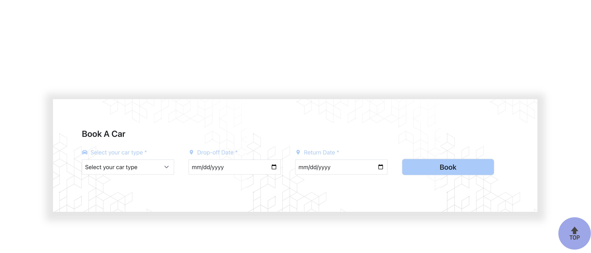

# Fleet

## Technologies Used:

* Node.js
* Bcrypt
* Tailwind 
* React
* Flowbite
* Mongo DB 
* Nodemon
* Stripe 

## Description

Booking a car is an essential part of any trip, but nobody likes the hassle of waiting around in an airport for their rental. Fleet - the car rental service that delivers to you. This app allows the user to  pick a date, time, and vehicle of their choice. We then deliver the vehicle to the user’s chosen location. When everything is done, we'll pick the vehicle back up from you. 

## Installation

No installation is required, just click the following link: https://fleet-rental.herokuapp.com/

## Usage

The user is presented with a landing page that features an option to book their vehicle and a navbar for further information regarding reservations and car collections. 
When the user clicks the “book a car” section of the landing page, they will be directed to a form asking for a drop-date, return date, and personal information. Once the user clicks “confirm” the app will be able to detect whether or not the user is logged in. If the user is not logged in or does not have an account, they will be redirected to the login page. 
After the user pays for their vehicle order, they will be redirected to the landing page. 

SCREENSHOT OF HOMEPAGE BELOW
    `
    
    
## Credits

* Maegan Batorek
* Nathaniel Vanderpoort
* Antonio Robledo-Yasaga 
* Jack Nguyễn 

